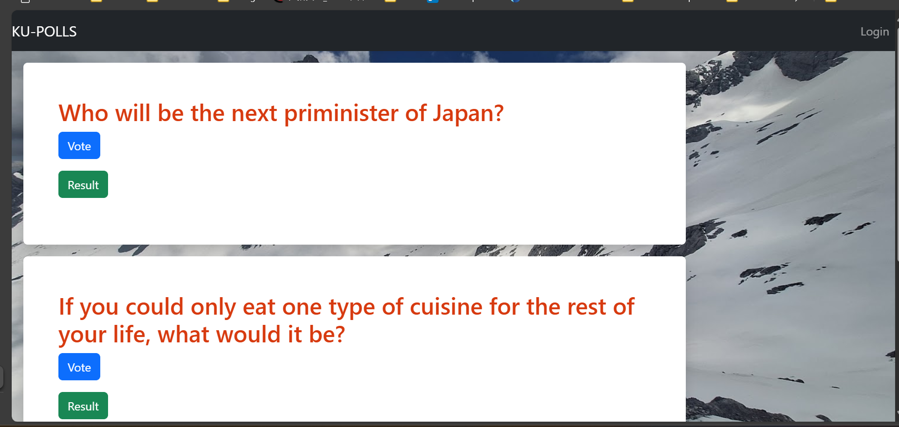

# Ku polls : An online survey service

[](https://github.com/knilios/ku-polls/actions/workflows/django.yml)
[](https://github.com/knilios/ku-polls/actions/workflows/flake8-test.yml)



This application is used to open online polls and surveys. It's based on ```Django``` web framework and written in Python.

This app is created as a part of [Individual Software Process](
https://cpske.github.io/ISP) course at [Kasetsart University](https://www.ku.ac.th) in the academic year 2024.

## Installation
The installation guide can be found [here](installation/installation.md).

## How to run
You can run the server by following these steps.
1. Activate Python virtual environment.
- For windows
```sh
cd venv/Scripts
activate
cd ../..
```
- For MacOS/Linux
```bash
source venv/bin/activate
```
2. Run the server.
```sh
python manage.py runserver
```

## Demo users
| username | password | 
|-------|----------| 
| demo1 | hackme11 | 
| demo2 | hackme22 | 
| demo3 | hackme33 |

## Project documents
All of the project documents can be access in [Project Wiki](../../wiki/Home).

- [Vision Statement](../../wiki/Vision-and-Scope)
- [Requirements](../../wiki/Requirements)
- [Project Plan](../../wiki/Project-Plan)
- [Iteration 1 Plan](../../wiki/Iteration-1-Plan)
- [Iteration 2 Plan](../../wiki/Iteration-2-Plan)
- [Iteration 3 Plan](../../wiki/Iteration-3-Plan)
- [Iteration 4 Plan](../../wiki/Iteration-4-Plan)
